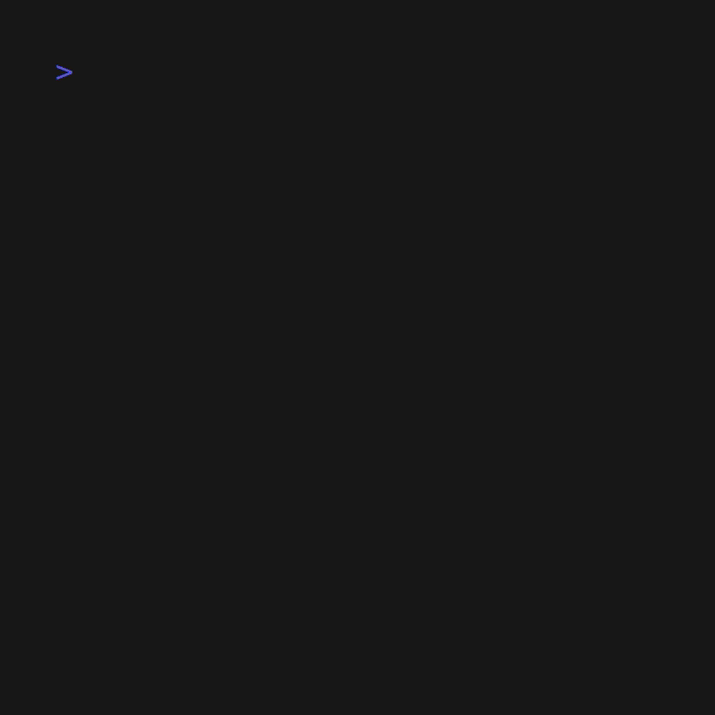
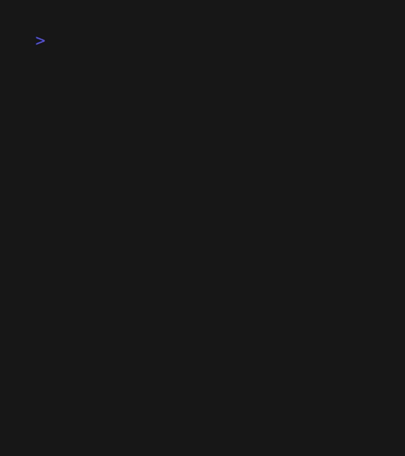
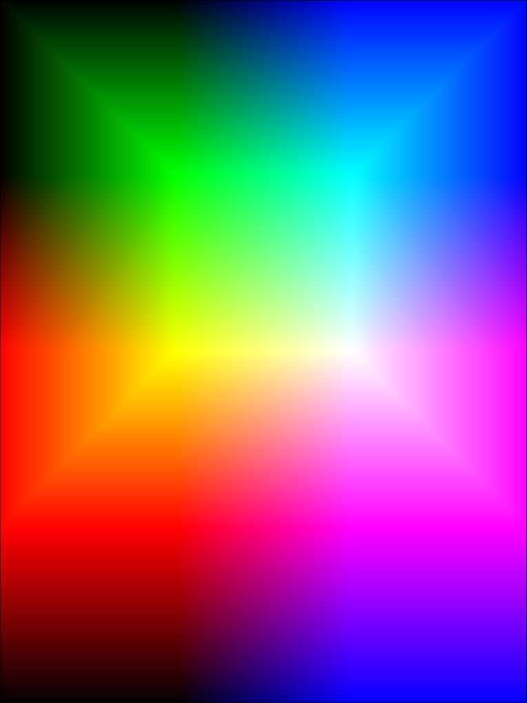

# Solid
The software unfold the rgb cube in a specific net and display it on terminal. 
Color amount, net shape, and cut orientation are configurable. Alternatively,
solid can show colors organized by HSL parameters with hexcode. 

## Demonstration
Ladder:\


Cross:\


Apply fill effect:\


Add more colors:\


## Installation
### Built binaries
Get it at [releases page](https://github.com/hecto600/Solid/releases)
### Build from source
```bash
git clone https://github.com/hecto600/Solid.git
cd solid 
cargo build --release 

```
## Usage
`solid [command][flag][options...]`

### Commands
#### rgb
Shows a 2d mapping rgb cube, with differents nets.

**Example**: `solid rgb`

- Options:
	- -b \<number\>:    
		Bits quantitiy for each r,g, and b channel. The range interval is [1,8].\
		It defines the amount of colors the cube net has.\
		As a example if the option is set with value 3, then:\
		Plane = (axis ^ 3) * (axis ^ 3)\
		Cube = Plane * 6\
		Therefore, the total amount of colors displayed is 384.\
		**Example**: `solid -b 3` 
		
	- -n \<name\>:  
		Type of 2d representation of the rgb cube. Available nets <name> are \
		"ladder" and "cross".\
		**Example**: `solid -n cross`

	- -c \<name\>:    
	      Variation of where the cube is opened. It defines which planes are separeted or not.\
	      Available \<name\> are `a` and `b`.\
	      **Example**: `solid -c a`

- Flag:    
	- -f:     
      Activate fill effect. Repeat the color to fulfill a rectangle.

#### hsl
Shows colors with Hue, saturation and lightness parameters.

**Example**: `solid hsl`

---
This project was made to learn more about colors and Rust.
